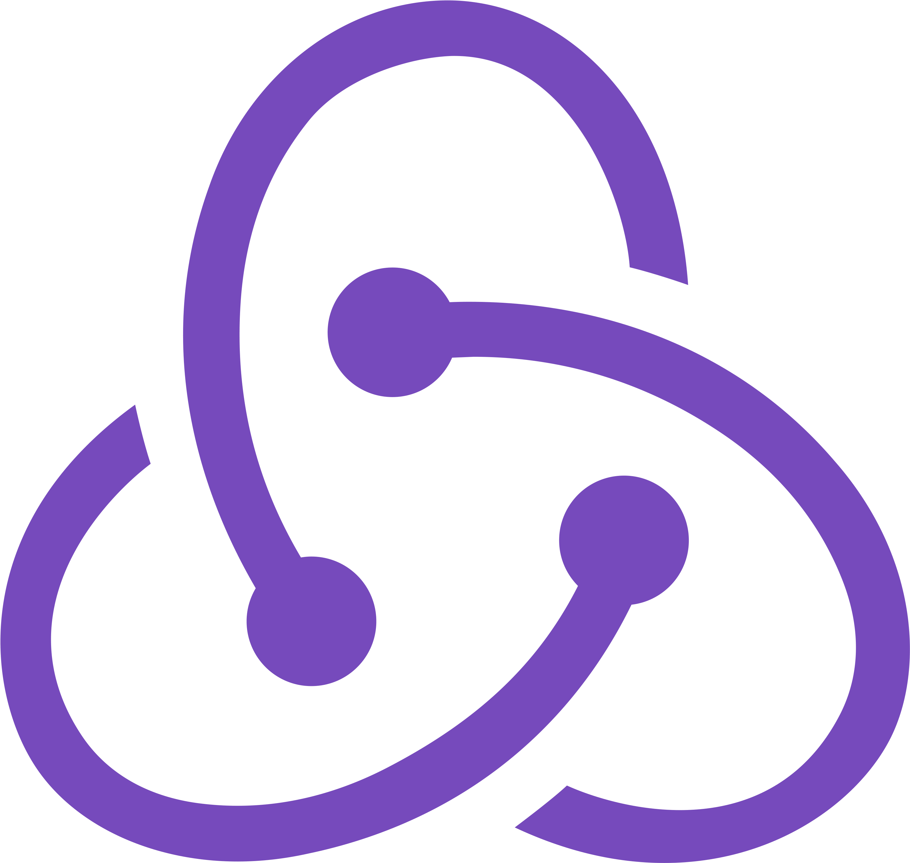
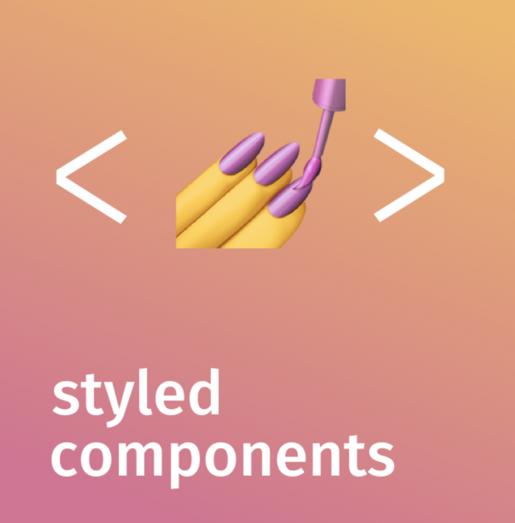

# 
I'm Eziz, a frontend developer 👨‍💻 🚀
  
   
  

  
  

- 🔭 I’m currently working on Skills  
  
- ⚡ Fun fact: I love eating food than cooking 😋  
  

   

## My Skill 👩‍💻

  
  
  
 
 
  
  
  
  
  

  
## Follow Me:

<h1 align="center">Hi 👋, I'm Eziz</h1>
<h3 align="center">A frontend developer.</h3>

<h3 align="left">Connect with me:</h3>

<h3 align="left">Languages and Tools:</h3>

            

