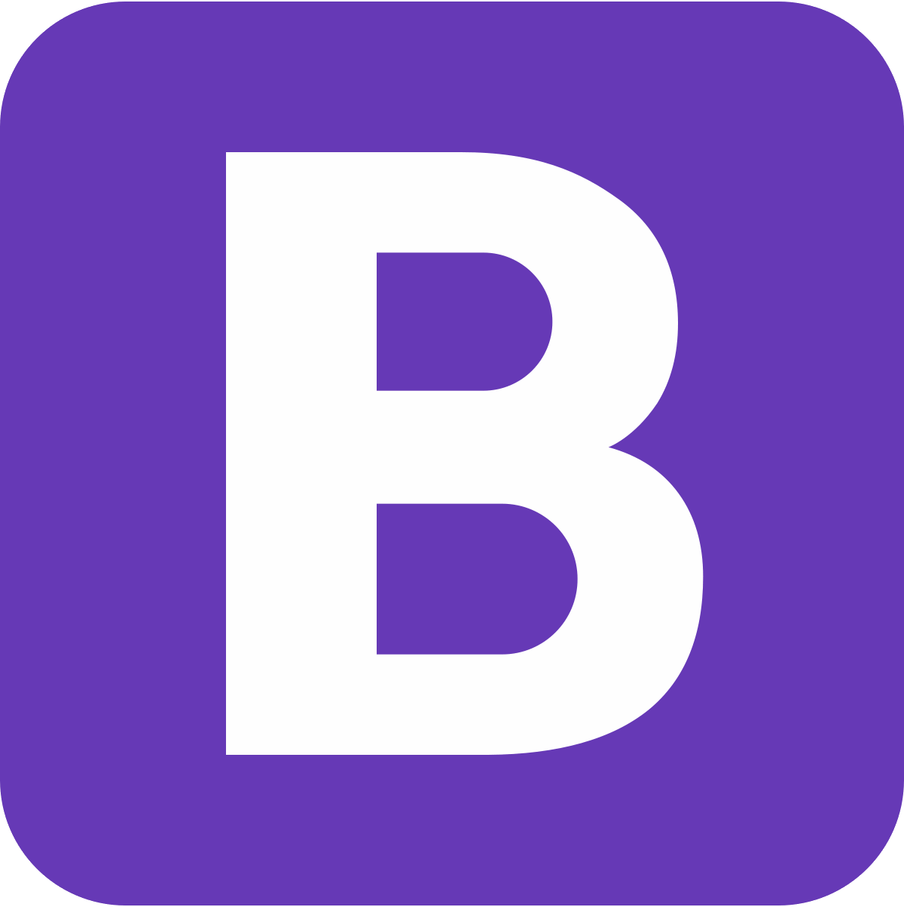

# 
I'm Eziz, a frontend developer 👨‍💻 🚀
  
   
  

  
  

- 🔭 I’m currently working on Skills  
  
- ⚡ Fun fact: I love eating food than cooking 😋  
  

   

## My Skill 👩‍💻

<table><tr><td valign="top" width="100%">

  
  
  
 
 
  
  
  
  
  

  
### Follow Me:

